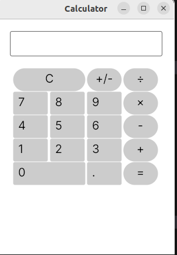

# Taschenrechner – Avalonia UI

Dieser einfache **Taschenrechner** wurde mit **C#** und **Avalonia UI** entwickelt und bietet eine intuitive, grafische Oberfläche zur Durchführung grundlegender Rechenoperationen.

## Funktionen

- **Addition**  
- **Subtraktion**  
- **Multiplikation**  
- **Division**

## Bedienung

1. Gib die gewünschte Zahl über das Zahlenfeld ein.  
2. Wähle einen Operator (`+`, `-`, `×`, `÷`).  
3. Gib die zweite Zahl ein.  
4. Drücke `=` um das Ergebnis anzuzeigen.

Beispiel: `12` `+` `5` `=` → **17**

## Zusatzfunktionen

- `C` – löscht die aktuelle Eingabe.  
- `+/-` – ändert das **Vorzeichen** der aktuellen Zahl (positiv ↔ negativ).  
- `.` – ermöglicht die Eingabe von **Dezimalzahlen**.

## Vorschau

## Technologie

- [C#](https://learn.microsoft.com/dotnet/csharp/)
- [Avalonia UI](https://avaloniaui.net/)
- .NET 8

---